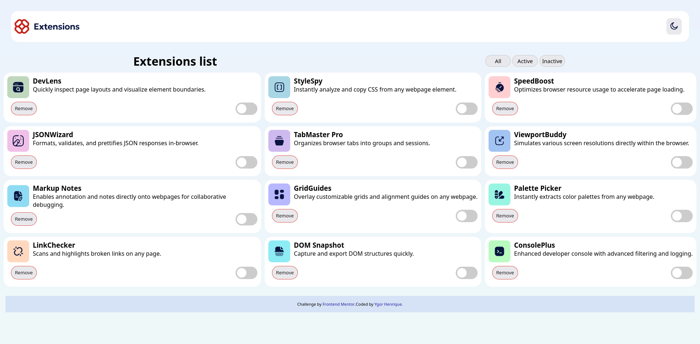
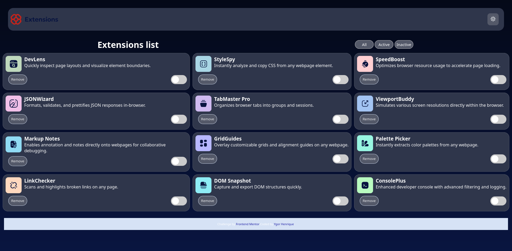

Claro! Aqui está seu README traduzido para o inglês, mantendo os links e códigos intactos:

---

# Frontend Mentor - Browser Extension Manager UI Challenge Solution

This is a solution to the [Browser Extension Manager UI challenge on Frontend Mentor](https://www.frontendmentor.io/challenges/browser-extension-manager-ui-yNZnOfsMAp). Frontend Mentor challenges help you improve your coding skills by building realistic projects.

## Table of Contents

* [Overview](#overview)

  * [The challenge](#the-challenge)
  * [Screenshot](#screenshot)
  * [Links](#links)
* [My process](#my-process)

  * [Built with](#built-with)
  * [What I learned](#what-i-learned)
  * [Continued development](#continued-development)
  * [Useful resources](#useful-resources)
* [Author](#author)
* [Acknowledgments](#acknowledgments)

## Overview

### The challenge

Users should be able to:

* Toggle extensions between active and inactive states
* Filter active and inactive extensions
* Remove extensions from the list
* Select the color theme
* View the optimal layout depending on the device screen size
* See focus and hover states for all interactive elements on the page

### Screenshot




### Links

* Solution URL: [Adicione a URL da solução aqui](https://your-solution-url.com)
* Live site URL: [Adicione a URL do site ao vivo aqui](https://your-live-site-url.com)

## My process

### Built with

* Semantic HTML5 markup
* CSS custom properties
* Flexbox
* CSS Grid
* Mobile-first workflow
* [React](https://reactjs.org/) – JavaScript library
* [Next.js](https://nextjs.org/) – React framework
* [Styled Components](https://styled-components.com/) – For styling

### What I learned

I learned and reinforced the use of the DOM and `eventListener`, which are important for site interactivity.

Example of HTML structure used as a base:

```html
 <div class="extensions-list-menu" id="extensions-list-menu">
        <h1>Extensions list</h1>

        <div class="container-buttons-view">
          <button id="btn_all" class="button-view">All</button>
          <button id="btn_active" class="button-view">Active</button>
          <button id="btn_inactive" class="button-view">Inactive</button>
        </div> 
    </div>
    

    <div class="extensions-list" id="extensions-list">
        <div class="box-item">
          <div class="extension-info">
            
            <div class="extension-name-description">
                <h3 class="extension-name">DevLens</h3>
                <p class="extension-description">Quickly inspect page layouts and visualize element boundaries.</p>
            </div>
          </div>

          <div class="change-element">
            <button class="btn_remove">Remove</button>
            
            <label class="switch">
                <input type="checkbox" class="btn_active-desative">
                <span class="slider"></span>
            </label>
          </div>

        </div>

        <div class="box-item">
          <div class="extension-info">
            
            <div class="extension-name-description">
                <h3 class="extension-name">StyleSpy</h3>
                <p class="extension-description">Instantly analyze and copy CSS from any webpage element.</p>
            </div>
          </div>

          <div class="change-element">
          <button class="btn_remove">Remove</button>
          <label class="switch">
              <input type="checkbox" class="btn_active-desative">
              <span class="slider"></span>
          </label>
          </div>
        </div>
    </div>
```

And the JavaScript used to handle functionality:

```js
  // Show all items
btn_all.addEventListener("click", () => {
  box_item.forEach((item) => {
    item.style.display = '';
  });
});

// Show only items with checkbox checked (active)
btn_active.addEventListener("click", () => {
  box_item.forEach((item) => {
    const checkbox = item.querySelector(".btn_active-desative");
    item.style.display = checkbox && checkbox.checked ? '' : 'none';
  });
});

// Show only items with checkbox unchecked (inactive)
btn_inactive.addEventListener("click", () => {
  box_item.forEach((item) => {
    const checkbox = item.querySelector(".btn_active-desative");
    item.style.display = checkbox && !checkbox.checked ? '' : 'none';
  });
});

/** Click event to remove the parent item when the .btn_remove is clicked */
document.querySelectorAll('.btn_remove').forEach(botao => {
  botao.addEventListener('click', function () {
    this.closest('.box-item').remove(); // Removes the corresponding .box-item
  });
});
```

The functionality of the buttons was what I liked the most — using `display` was important to make the buttons work correctly.

### Continued development

I plan to strengthen my knowledge in JSON and learn to use Bootstrap to make styling easier.

## Author

* Site - [browser-extension-manager-ui-site](https://ygorhslima.github.io/browser-extension-manager-ui-site/)
* Frontend Mentor - [@ygorhslima](https://www.frontendmentor.io/profile/ygorhslima)

